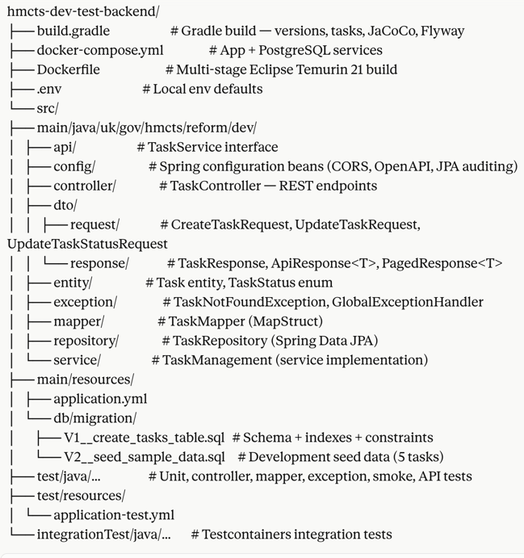

# Task Manager API

Enterprise-grade REST API for task management, built for HMCTS. Built with **Spring Boot 3.5.11**, **Java 21**, **PostgreSQL 16**, **Flyway**, **MapStruct**, and a comprehensive, multi-layered test suite.

---

## Quick Start

### Prerequisites

- Java 21+ (Eclipse Temurin recommended)
- Docker & Docker Compose
- Gradle 8.x (or use the included `./gradlew` wrapper)

### Run with Docker Compose

```bash
# Create the shared network (one-time setup)
docker network create task-network

docker compose up --build
```

The application starts on **port 8787** (mapped from container port 8080).

| Resource        | URL                                              |
|-----------------|--------------------------------------------------|
| API Base        | `http://localhost:8787/api/v1`                   |
| Swagger UI      | `http://localhost:8787/swagger-ui/index.html`    |
| OpenAPI JSON    | `http://localhost:8787/api-docs`                 |
| Actuator Health | `http://localhost:8787/actuator/health`          |

> **Docker resource allocation:** The app container is allocated 3 GB RAM / 2 CPUs. PostgreSQL gets 1 GB RAM / 1 CPU. Adjust `mem_limit` in `docker-compose.yml` if running on a constrained machine.

### Run Locally (requires PostgreSQL)

```bash
# PostgreSQL must be accessible on port 5433 (as per docker-compose.yml default)
export DB_HOST=localhost
export DB_PORT=5433
export DB_NAME=taskmanager
export DB_USERNAME=postgres
export DB_PASSWORD=postgres
export SERVER_PORT=8080

./gradlew bootRun
```

> When running locally without Docker, the API is at `http://localhost:8080`. Set `SERVER_PORT=8787` if you want to match the Docker port.

### Environment Variables

| Variable       | Default               | Description                          |
|----------------|-----------------------|--------------------------------------|
| `DB_HOST`      | `localhost`           | PostgreSQL host                      |
| `DB_PORT`      | `5432`                | PostgreSQL port                      |
| `DB_NAME`      | `taskmanager`         | Database name                        |
| `DB_USERNAME`  | `postgres`            | Database username                    |
| `DB_PASSWORD`  | `postgres`            | Database password                    |
| `SERVER_PORT`  | `8080`                | Application port (inside container)  |
| `CORS_ORIGINS` | `http://localhost:8087` | Allowed CORS origin(s)             |

---

## API Reference

### Endpoints

| Method   | Path                           | Description                          | Success |
|----------|--------------------------------|--------------------------------------|---------|
| `POST`   | `/api/v1/tasks`                | Create a new task                    | `201`   |
| `GET`    | `/api/v1/tasks`                | Get all tasks (paginated, filtered)  | `200`   |
| `GET`    | `/api/v1/tasks/{id}`           | Get a task by UUID                   | `200`   |
| `PUT`    | `/api/v1/tasks/{id}`           | Full update of a task                | `200`   |
| `PATCH`  | `/api/v1/tasks/{id}/status`    | Update task status only              | `200`   |
| `DELETE` | `/api/v1/tasks/{id}`           | Delete a task                        | `204`   |

All IDs are **UUID v4**.

### Task Status Values

TODO  |  IN_PROGRESS  |  ON_HOLD  |  DONE  |  CANCELLED

Status values are case-insensitive on input (Jackson `@JsonCreator` handles normalisation).

### GET /api/v1/tasks — Query Parameters

| Parameter   | Type          | Default      | Description                          |
|-------------|---------------|--------------|--------------------------------------|
| `status`    | `TaskStatus`  | —            | Filter by status                     |
| `title`     | `String`      | —            | Partial title match (case-sensitive) |
| `page`      | `int`         | `0`          | Page number (0-indexed)              |
| `size`      | `int`         | `20`         | Page size (max 100)                  |
| `sortBy`    | `String`      | `createdAt`  | Sort field                           |
| `direction` | `ASC`/`DESC`  | `DESC`       | Sort direction                       |

### Request Payloads

**Create Task** (`POST /api/v1/tasks`)

```json
{
  "title": "Implement login feature",
  "description": "Implement OAuth2 login with Google",
  "status": "TODO",
  "dueDate": "2025-12-31T23:59:59Z"
}
```

| Field         | Required | Constraints                              |
|---------------|----------|------------------------------------------|
| `title`       | Yes      | 1–255 characters                         |
| `description` | No       | Max 5,000 characters                     |
| `status`      | Yes      | One of the valid `TaskStatus` values     |
| `dueDate`     | No       | ISO-8601 `OffsetDateTime`, must be future|

**Update Task** (`PUT /api/v1/tasks/{id}`) — all fields optional:

```json
{
  "title": "Updated title",
  "description": "Updated description",
  "status": "IN_PROGRESS",
  "dueDate": "2026-06-01T09:00:00Z"
}
```

**Update Status** (`PATCH /api/v1/tasks/{id}/status`):

```json
{
  "status": "DONE"
}
```

### Response Envelope

All endpoints (except `DELETE`) wrap their payload in a consistent envelope:

```json
{
  "success": true,
  "message": "Task created successfully",
  "data": { ... },
  "timestamp": "2026-05-03T10:00:00Z"
}
```

Error responses follow the same shape with `"success": false` and a descriptive `"message"`.

**Paginated responses** (`GET /api/v1/tasks`) nest a `PagedResponse` inside `data`:

```json
{
  "success": true,
  "data": {
    "content": [ ... ],
    "page": 0,
    "size": 20,
    "totalElements": 42,
    "totalPages": 3,
    "last": false
  }
}
```

### Task Response Fields

| Field       | Type             | Description                          |
|-------------|------------------|--------------------------------------|
| `id`        | `UUID`           | Unique task identifier               |
| `title`     | `String`         | Task title                           |
| `description` | `String`       | Optional description                 |
| `status`    | `TaskStatus`     | Current lifecycle status             |
| `dueDate`   | `OffsetDateTime` | Due date (UTC, ISO-8601)             |
| `createdAt` | `OffsetDateTime` | Creation timestamp (UTC)             |
| `updatedAt` | `OffsetDateTime` | Last updated timestamp (UTC)         |
| `version`   | `Long`           | Optimistic locking version counter   |

### Error Codes

| HTTP Status | Scenario                                              |
|-------------|-------------------------------------------------------|
| `400`       | Validation failure, malformed JSON, invalid enum value|
| `404`       | Task not found, unknown route                         |
| `409`       | Optimistic locking conflict (concurrent modification) |
| `500`       | Unexpected server error                               |

---

## Running Tests

The project uses **Gradle** with separate tasks for each test tier. The `check` task runs all tiers plus JaCoCo coverage enforcement.

```bash
# Run all verifications (unit + API + integration + smoke + coverage)
./gradlew check

# Unit tests only
./gradlew test

# API contract tests (RestAssured MockMvc)
./gradlew apiTest

# Integration tests (Testcontainers + PostgreSQL)
./gradlew integrationTest

# Smoke tests only
./gradlew smokeTest

# Generate coverage report (build/reports/jacoco/html/index.html)
./gradlew jacocoTestReport
```

### Test Categories

| Type         | Class Pattern            | Task            | Description                                               |
|--------------|--------------------------|-----------------|-----------------------------------------------------------|
| Unit         | `*Test.java`             | `test`          | Pure unit tests with Mockito                              |
| Controller   | `*ControllerTest.java`   | `test`          | MockMvc slice tests for request/response handling         |
| Repository   | `*RepositoryTest.java`   | `test`          | `@DataJpaTest` with H2 in-memory database                 |
| Mapper       | `*MapperTest.java`       | `test`          | MapStruct mapping correctness                             |
| Exception    | `*HandlerTest.java`      | `test`          | `@RestControllerAdvice` handler coverage                  |
| Smoke        | `*SmokeTest.java`        | `smokeTest`     | Context loads, bean wiring, actuator health, 404 routing  |
| API Contract | `*ApiTest.java`          | `apiTest`       | RestAssured MockMvc end-to-end contract tests             |
| Integration  | `*IT.java` / `*IntegrationTest.java` | `integrationTest` | Full Spring context with Testcontainers + PostgreSQL |

### Coverage Enforcement

JaCoCo enforces **80% line coverage** at build time. The following packages are excluded from the threshold: `mapper`, `entity`, `dto`, `config`, and the main `Application` class. A failing coverage gate will break the `check` task.

---

## Project Structure



---

## Database Schema

Flyway manages all schema migrations. The `tasks` table is created at `V1` with the following structure:

| Column        | Type           | Constraints                                        |
|---------------|----------------|----------------------------------------------------|
| `id`          | `UUID`         | Primary key, `gen_random_uuid()`                   |
| `title`       | `VARCHAR(255)` | Not null, min length 1                             |
| `description` | `TEXT`         | Nullable                                           |
| `status`      | `VARCHAR(50)`  | Not null, check constraint on allowed values       |
| `due_date`    | `TIMESTAMPTZ`  | Nullable, stored as UTC                            |
| `created_at`  | `TIMESTAMPTZ`  | Not null, auto-set                                 |
| `updated_at`  | `TIMESTAMPTZ`  | Not null, auto-updated                             |
| `version`     | `BIGINT`       | Optimistic locking counter, default 0              |

**Indexes:** `idx_tasks_status`, `idx_tasks_due_date`, `idx_tasks_created_at` (DESC).

Flyway connects to `localhost:5433/taskmanager` for CLI operations (local dev). Inside Docker, Flyway runs automatically on startup.

---

## Design Decisions

- **Records for DTOs** — Java 21 records give immutability and zero-boilerplate request/response contracts.
- **MapStruct** — Compile-time, zero-reflection mapping between entity and DTOs. No runtime performance overhead.
- **Optimistic Locking** — `@Version` on `Task` prevents lost-update anomalies under concurrent modification; conflicts surface as `409 Conflict`.
- **Flyway** — Versioned schema migrations with `validate-on-migrate: true` in production. `V2` seed data is applied automatically on first run.
- **RestAssured MockMvc** — API contract tests run without a live server, keeping them fast and deterministic.
- **Testcontainers** — Integration tests spin up a real PostgreSQL 16 container, matching production behaviour exactly.
- **H2 in test profile** — Unit and API tests use H2 for speed and zero infrastructure dependency.
- **JaCoCo** — 80% line coverage minimum enforced at build time; gate fails the `check` task.
- **Multi-stage Docker build** — Builder stage uses JDK 21 Alpine; runtime stage uses JRE 21 Alpine with a non-root `appuser`.
- **`-XX:MaxRAMPercentage=75.0`** — Container-aware heap sizing; no hard `-Xmx` needed at the Docker level.
- **Lombok + MapStruct binding** — `lombok-mapstruct-binding` ensures annotation processors run in the correct order.
